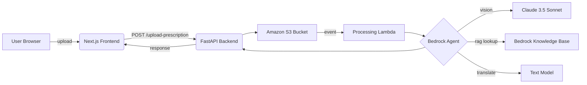

# Design for AWS‑based CareGuide AI

## High‑Level Architecture



### Components
* **Frontend (Next.js)** – Standard upload form, language selector, display of guidance.
* **Backend (FastAPI)** – Acts as orchestrator and AWS SDK broker.
* **S3 Bucket** – Stores raw prescription images. Configured with an ObjectCreated trigger pointing to a Lambda function.
* **Lambda** – Lightweight Python function that pulls the image key from S3 and calls the Bedrock Agent endpoint.
* **Bedrock Agent** – Custom agent created via the Bedrock console/SDK; it runs three sub-steps:
  1. **Vision analysis**: call the multimodal model (`anthropic.claude-3.5-sonnet`) with the image bytes and prompt to return JSON.
  2. **RAG query**: look up each medicine name in a Knowledge Base built from RxNorm/OpenFDA.
  3. **Translation**: use a text model (`amazon.titan-??`) to convert the enriched guidance into the requested language.
* **Knowledge Base (Bedrock)** – Ingested data linking medicine identifiers to descriptions, dosage instructions, warnings, etc.

## Orchestration Flow
1. User uploads image via frontend.
2. Backend saves file to S3 and returns a job ID.
3. S3 triggers Lambda, which invokes the Bedrock Agent with the image URI and the desired language.
4. Agent performs vision, RAG, translation, then returns a structured guidance object.
5. Lambda writes the output to DynamoDB (or returns directly to backend via webhook).
6. Backend exposes a `/jobs/{id}` endpoint for clients to poll the result.

## Data Models
```json
{
  "medicines": [
    { "name": "paracetamol", "dosage": "500mg", "duration": "5 days", "instructions_en": "Take after food" }
  ],
  "language": "hi",
  "guidance": "... (Hindi translated text) ..."
}
```

## Kiro Tasks in Design
* **Create agent specification** – Write a YAML/JSON description for the Bedrock Agent that ties the vision model output schema to the RAG step.
* **Define RAG KB schema** – Map RxNorm fields to agent-friendly attributes (e.g. `DrugName`, `Indication`, `SideEffects`).
* **Lambda stub** – Python code skeleton that obtains object key and calls the agent.
* **Backend integration** – Add `aws_service.py` with `analyze_prescription` and `get_result(job_id)` methods; update router accordingly.

## Deployment Notes
* **Infrastructure as Code** – Consider using AWS CDK or Serverless Framework to provision S3, Lambda, and Bedrock resources.
* **Environment variables** – `BEDROCK_ENDPOINT`, `S3_BUCKET`, `AWS_REGION`.
* **Security** – IAM role for Lambda/EC2 with `bedrock:InvokeModel`, `s3:GetObject`, `kms:Decrypt`.


This design satisfies the SDD requirements and ensures all processing runs on AWS generative services.
